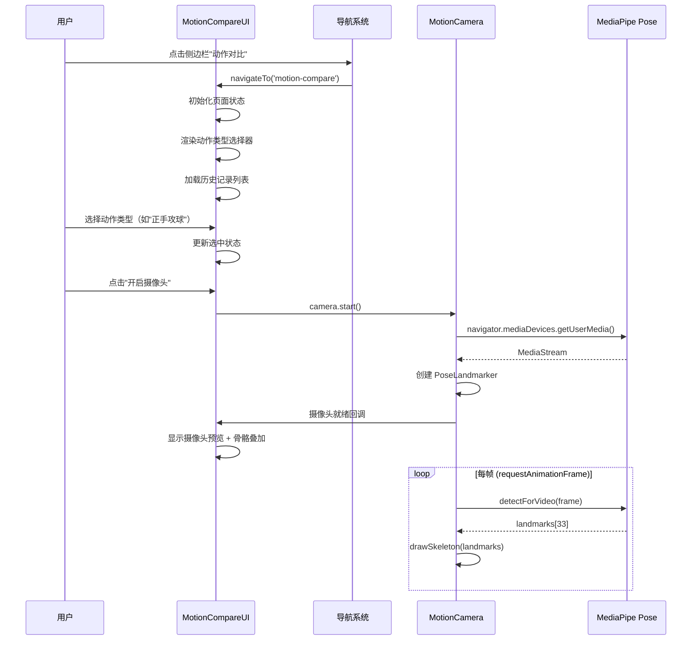
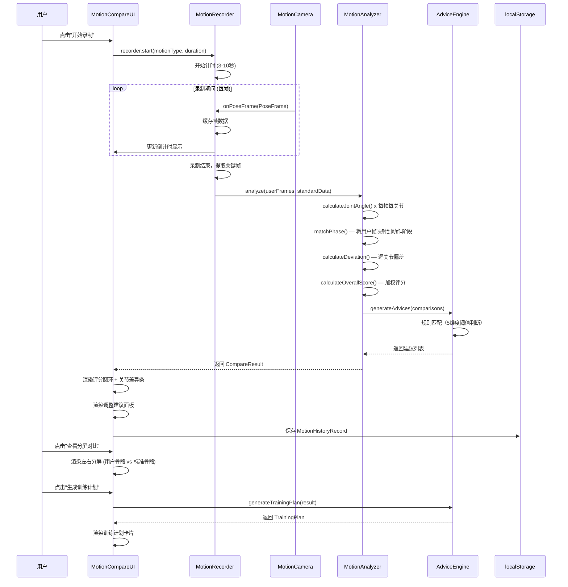
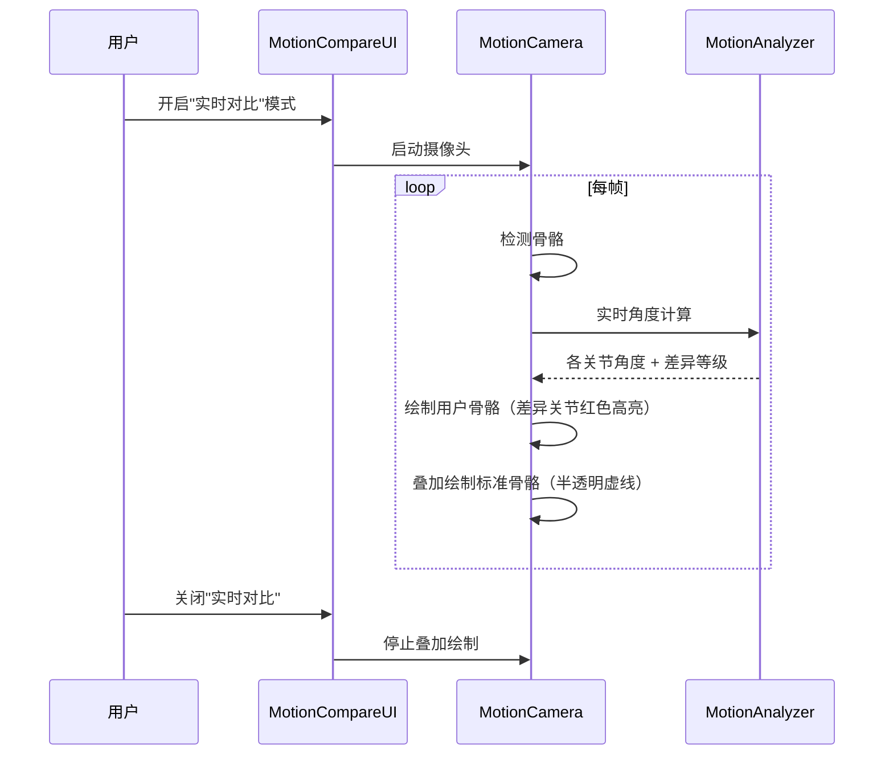
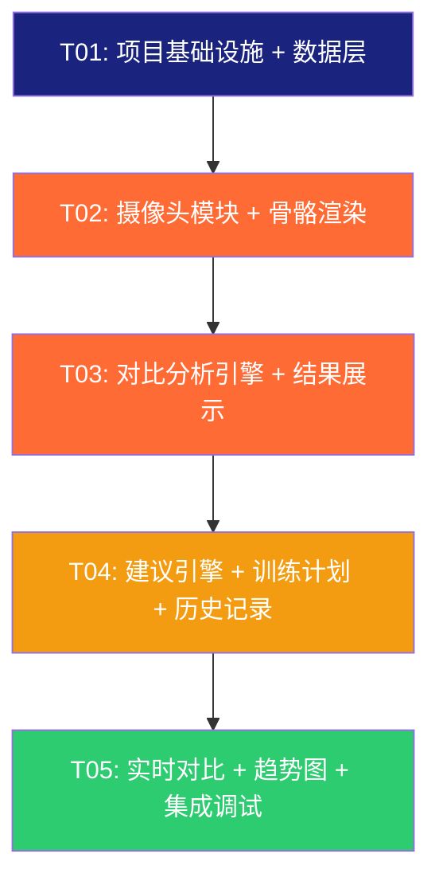

# 🏓 乒乓球动作对比分析 — 系统架构设计

> 本文档为「乒乓球 AI 教学系统」新增"动作对比分析"功能的架构设计与任务分解。

---

## 1. 实现方案 + 框架选型

### 1.1 核心技术挑战

| 挑战 | 说明 | 应对方案 |
|------|------|----------|
| MediaPipe Pose 实时骨骼识别 | 浏览器端实时推理，需≥15FPS | 使用 `@mediapipe/tasks-vision` CDN，WebGL 加速；独立 requestAnimationFrame 循环 |
| 动作对比分析算法 | 需从 33 个关键点中提取有意义的动作差异 | 基于"关节角度"做对比（5 大关节维度），而非原始坐标距离，避免身高/站位差异干扰 |
| 单文件架构下的代码组织 | 所有代码内嵌在一个 HTML 中，容易变得难以维护 | JS 按模块化注释分区（// ====== SECTION ======），CSS 按组件分区，严格命名约定 |
| 实时视频叠加渲染 | 需在同一画面上同时绘制摄像头画面 + 骨骼连线 | 双 Canvas 分层：底层 video 纹理 + 上层骨骼绘制，避免每帧重绘全部 |
| 录制帧数据存储 | 3-10 秒视频骨骼数据需临时存储 | 使用 TypedArray 存储关键帧序列，录制结束后立即分析并释放 |

### 1.2 框架/库选型

| 库 | 版本 | 用途 | 选型理由 |
|----|------|------|----------|
| **MediaPipe Vision Tasks** | 0.10.14+ | 骨骼关键点检测 | 官方推荐的 Web SDK，支持 Pose Landmarker，33 关键点 |
| **Chart.js** | 4.4.0（已引入） | 趋势图/评分雷达图 | 已有系统依赖，复用即可 |
| **Font Awesome** | 6.5.0（已引入） | 图标 | 已有系统依赖 |
| **Google Fonts - Noto Sans SC** | 已引入 | 字体 | 已有系统依赖 |

> **不引入新框架**。所有功能基于原生 JS + 已有依赖实现。

### 1.3 架构模式

采用 **MVC 变体**（在单文件内以逻辑分区实现）：

- **Model**：数据结构定义 + 马龙标准动作数据 + localStorage 读写
- **View**：HTML 页面模板 + CSS 样式（动作对比页面 + 各子组件）
- **Controller**：摄像头管理器 + 录制控制器 + 对比分析引擎 + 建议生成器 + 训练计划生成器

### 1.4 页面级架构

```
现有系统
├── 仪表盘 (dashboard)
├── 训练记录 (training)
├── 动作分析 (analysis) ← 现有，将改造
├── 成长复盘 (progress)
├── 课程计划 (course)
│
└── 🆕 动作对比 (motion-compare) ← 新增导航项 + 新页面
    ├── 顶部操作栏（动作类型选择 + 摄像头控制）
    ├── 摄像头预览区（实时骨骼叠加）
    ├── 录制控制条（开始/停止/倒计时）
    ├── 对比结果区（左右分屏/差异高亮）
    ├── 调整建议面板（5 关节维度分析 + 文字建议）
    ├── 个性化训练计划（1-4 周推荐）
    └── 历史记录列表（localStorage 读取）
```

---

## 2. 文件列表及代码组织结构

> 本项目为**单文件应用**（`index.html`），但代码按逻辑区块严格分区组织。

### 2.1 HTML 结构分区

| 区块 | 说明 | 行号范围（预估） |
|------|------|------------------|
| `<head>` — 已有 CSS | 现有样式，保持不变 | 已有 |
| `<head>` — 🆕 动作对比 CSS | 新增样式区块 | 新增 |
| 侧边栏 — 🆕 导航项 | 新增"动作对比"导航 | 修改 |
| 移动端导航 — 🆕 导航项 | 新增底部导航项 | 修改 |
| `page-motion-compare` — 🆕 主页面 | 动作对比完整页面 | 新增 |
| `modal-compare-result` — 🆕 结果弹窗 | 对比结果详情弹窗 | 新增 |

### 2.2 CSS 分区（新增）

```
/* ============ MOTION COMPARE ============ */
/* -- 布局与容器 -- */
.motion-compare-layout { ... }        /* 整体两栏布局 */
.motion-video-container { ... }       /* 视频预览区 */
.motion-result-container { ... }       /* 结果面板区 */

/* -- 摄像头与视频 -- */
.motion-canvas-wrapper { ... }         /* Canvas 容器 */
.motion-canvas-overlay { ... }         /* 骨骼叠加层 */
.motion-camera-placeholder { ... }     /* 无摄像头占位 */

/* -- 录制控制 -- */
.motion-record-bar { ... }            /* 录制控制条 */
.motion-record-timer { ... }          /* 录制倒计时 */
.motion-record-indicator { ... }      /* 录制中红点 */

/* -- 动作选择器 -- */
.motion-type-selector { ... }          /* 动作类型选择卡片 */
.motion-type-card { ... }             /* 单个动作卡片 */
.motion-type-card.active { ... }      /* 选中状态 */

/* -- 对比结果 -- */
.motion-compare-result { ... }        /* 对比结果容器 */
.motion-score-ring { ... }            /* 综合评分圆环 */
.motion-joint-item { ... }            /* 关节评分项 */
.motion-joint-bar { ... }             /* 关节评分进度条 */
.motion-joint-bar.danger { ... }      /* 差异大-红色 */
.motion-joint-bar.warning { ... }     /* 差异中-橙色 */
.motion-joint-bar.good { ... }        /* 差异小-绿色 */

/* -- 分屏对比 -- */
.motion-split-view { ... }           /* 左右分屏容器 */
.motion-split-half { ... }           /* 单侧画面 */
.motion-skeleton-canvas { ... }       /* 骨骼绘制 Canvas */

/* -- 建议面板 -- */
.motion-advice-panel { ... }          /* 建议面板 */
.motion-advice-item { ... }           /* 单条建议 */
.motion-advice-item.shoulder { ... }  /* 肩部建议 */
.motion-advice-item.elbow { ... }     /* 肘部建议 */
.motion-advice-item.wrist { ... }     /* 腕部建议 */
.motion-advice-item.hip { ... }       /* 髋部建议 */
.motion-advice-item.knee { ... }      /* 膝部建议 */

/* -- 训练计划 -- */
.motion-training-plan { ... }        /* 训练计划卡片 */
.motion-plan-week { ... }            /* 单周计划 */

/* -- 历史记录 -- */
.motion-history-item { ... }         /* 历史记录条目 */
```

### 2.3 JavaScript 分区（新增）

```
// ====== MOTION COMPARE: DATA ======
// - 马龙标准动作数据 (MALONG_STANDARD_DATA)
// - 关节角度定义 (JOINT_DEFINITIONS)
// - 建议规则库 (ADVICE_RULES)
// - localStorage 读写函数

// ====== MOTION COMPARE: CAMERA ======
// - MotionCamera 类：摄像头初始化/关闭/帧回调
// - 骨骼绘制函数 (drawSkeleton)

// ====== MOTION COMPARE: RECORDER ======
// - MotionRecorder 类：录制开始/停止/关键帧提取
// - 帧数据缓存管理

// ====== MOTION COMPARE: ANALYZER ======
// - MotionAnalyzer 类：角度计算/对比分析/评分
// - 关节角度计算 (calculateJointAngle)
// - 差异计算 (calculateDeviation)
// - 综合评分 (calculateOverallScore)

// ====== MOTION COMPARE: ADVICE ======
// - AdviceEngine 类：规则匹配/建议生成
// - 训练计划生成 (generateTrainingPlan)

// ====== MOTION COMPARE: UI CONTROLLER ======
// - MotionCompareUI 类：页面状态管理/事件绑定/渲染
// - 页面初始化/导航集成
// - 实时模式控制
// - 结果弹窗管理
// - 历史记录管理
```

---

## 3. 数据结构和接口

### 3.1 骨骼关键点

```typescript
/** MediaPipe Pose 33 关键点索引枚举（部分） */
enum PoseLandmark {
  NOSE = 0,
  LEFT_SHOULDER = 11, RIGHT_SHOULDER = 12,
  LEFT_ELBOW = 13,    RIGHT_ELBOW = 14,
  LEFT_WRIST = 15,     RIGHT_WRIST = 16,
  LEFT_HIP = 23,       RIGHT_HIP = 24,
  LEFT_KNEE = 25,      RIGHT_KNEE = 26,
  LEFT_ANKLE = 27,     RIGHT_ANKLE = 28,
}

/** 单个关键点数据 */
interface Landmark {
  x: number;       // 归一化 x [0,1]，相对于画面宽度
  y: number;       // 归一化 y [0,1]，相对于画面高度
  z: number;       // 深度，相对髋部中心
  visibility: number; // 可见度 [0,1]
}

/** 一帧的骨骼数据（33个关键点） */
interface PoseFrame {
  landmarks: Landmark[];       // 33 个关键点
  worldLandmarks: Landmark[]; // 3D 世界坐标
  timestamp: number;          // 帧时间戳 (ms)
}
```

### 3.2 关节角度定义

```typescript
/** 关节角度由 3 个关键点定义：点A-点B(顶点)-点C */
interface JointDefinition {
  id: string;            // 关节标识，如 'right_shoulder'
  name: string;          // 中文显示名，如 '右肩'
  pointA: number;        // 端点 A 的关键点索引
  vertex: number;        // 顶点 B（关节本身）的关键点索引
  pointC: number;        // 端点 C 的关键点索引
  dimension: 'shoulder' | 'elbow' | 'wrist' | 'hip' | 'knee'; // 所属维度
  side: 'left' | 'right'; // 左右侧
}

/** 系统追踪的 10 个关节角度 */
const JOINT_DEFINITIONS: JointDefinition[] = [
  // 肩关节（shoulder）
  { id: 'right_shoulder', name: '右肩', pointA: 12, vertex: 14, pointC: 24, dimension: 'shoulder', side: 'right' },
  { id: 'left_shoulder',  name: '左肩', pointA: 11, vertex: 13, pointC: 23, dimension: 'shoulder', side: 'left'  },
  // 肘关节（elbow）
  { id: 'right_elbow', name: '右肘', pointA: 12, vertex: 14, pointC: 16, dimension: 'elbow', side: 'right' },
  { id: 'left_elbow',  name: '左肘', pointA: 11, vertex: 13, pointC: 15, dimension: 'elbow', side: 'left'  },
  // 腕关节（wrist）— 用手腕相对前臂的角度
  { id: 'right_wrist', name: '右腕', pointA: 14, vertex: 16, pointC: 20, dimension: 'wrist', side: 'right' },
  { id: 'left_wrist',  name: '左腕', pointA: 13, vertex: 15, pointC: 19, dimension: 'wrist', side: 'left'  },
  // 髋关节（hip）
  { id: 'right_hip', name: '右髋', pointA: 12, vertex: 24, pointC: 26, dimension: 'hip', side: 'right' },
  { id: 'left_hip',  name: '左髋', pointA: 11, vertex: 23, pointC: 25, dimension: 'hip', side: 'left'  },
  // 膝关节（knee）
  { id: 'right_knee', name: '右膝', pointA: 24, vertex: 26, pointC: 28, dimension: 'knee', side: 'right' },
  { id: 'left_knee',  name: '左膝', pointA: 23, vertex: 25, pointC: 27, dimension: 'knee', side: 'left'  },
];
```

### 3.3 马龙标准动作数据

```typescript
/** 动作类型 */
type MotionType = 'forehand_attack' | 'backhand_flick' | 'serve';

/** 动作元数据 */
interface MotionMeta {
  id: MotionType;
  name: string;           // '正手攻球' | '反手拨球' | '发球'
  icon: string;          // emoji 图标
  description: string;    // 简短描述
  dominantSide: 'right'; // 优势侧（乒乓球以右手为例）
}

/** 标准动作的关键帧角度 */
interface StandardKeyFrame {
  phase: string;         // 动作阶段：'ready' | 'backswing' | 'hit' | 'follow_through' | 'recovery'
  phaseName: string;     // 中文阶段名：'准备' | '引拍' | '击球' | '随挥' | '还原'
  joints: Record<string, number>; // 关节ID → 标准角度（度）
}

/** 完整的标准动作数据 */
interface StandardMotion {
  meta: MotionMeta;
  keyFrames: StandardKeyFrame[];
}

/** 马龙标准动作数据集（JSON 内嵌） */
const MALONG_STANDARD_DATA: Record<MotionType, StandardMotion> = {
  forehand_attack: {
    meta: { id: 'forehand_attack', name: '正手攻球', icon: '🏓', description: '马龙标志性正手攻球动作', dominantSide: 'right' },
    keyFrames: [
      { phase: 'ready',          phaseName: '准备', joints: { right_shoulder: 30, right_elbow: 100, right_wrist: 170, right_hip: 170, right_knee: 170, left_shoulder: 20, left_elbow: 90, left_hip: 175, left_knee: 175 } },
      { phase: 'backswing',     phaseName: '引拍', joints: { right_shoulder: 60, right_elbow: 120, right_wrist: 150, right_hip: 160, right_knee: 160, left_shoulder: 15, left_elbow: 85, left_hip: 175, left_knee: 170 } },
      { phase: 'hit',           phaseName: '击球', joints: { right_shoulder: 45, right_elbow: 140, right_wrist: 165, right_hip: 165, right_knee: 165, left_shoulder: 25, left_elbow: 95, left_hip: 170, left_knee: 172 } },
      { phase: 'follow_through', phaseName: '随挥', joints: { right_shoulder: 80, right_elbow: 130, right_wrist: 140, right_hip: 155, right_knee: 160, left_shoulder: 10, left_elbow: 80, left_hip: 178, left_knee: 168 } },
      { phase: 'recovery',      phaseName: '还原', joints: { right_shoulder: 35, right_elbow: 105, right_wrist: 168, right_hip: 168, right_knee: 168, left_shoulder: 18, left_elbow: 88, left_hip: 173, left_knee: 174 } },
    ]
  },
  backhand_flick: {
    meta: { id: 'backhand_flick', name: '反手拨球', icon: '🎯', description: '马龙反手快速拨球技术', dominantSide: 'right' },
    keyFrames: [
      { phase: 'ready',          phaseName: '准备', joints: { left_shoulder: 25, left_elbow: 95, left_wrist: 172, right_hip: 172, right_knee: 172, right_shoulder: 20, right_elbow: 88, left_hip: 170, left_knee: 170 } },
      { phase: 'backswing',     phaseName: '引拍', joints: { left_shoulder: 50, left_elbow: 75, left_wrist: 155, right_hip: 165, right_knee: 165, right_shoulder: 15, right_elbow: 85, left_hip: 168, left_knee: 168 } },
      { phase: 'hit',           phaseName: '击球', joints: { left_shoulder: 35, left_elbow: 130, left_wrist: 160, right_hip: 168, right_knee: 168, right_shoulder: 22, right_elbow: 90, left_hip: 172, left_knee: 170 } },
      { phase: 'follow_through', phaseName: '随挥', joints: { left_shoulder: 55, left_elbow: 120, left_wrist: 145, right_hip: 162, right_knee: 165, right_shoulder: 18, right_elbow: 82, left_hip: 170, left_knee: 166 } },
      { phase: 'recovery',      phaseName: '还原', joints: { left_shoulder: 28, left_elbow: 98, left_wrist: 170, right_hip: 170, right_knee: 170, right_shoulder: 20, right_elbow: 87, left_hip: 172, left_knee: 172 } },
    ]
  },
  serve: {
    meta: { id: 'serve', name: '发球', icon: '💫', description: '马龙标志性发球动作', dominantSide: 'right' },
    keyFrames: [
      { phase: 'ready',          phaseName: '准备', joints: { right_shoulder: 25, right_elbow: 90, right_wrist: 175, right_hip: 170, right_knee: 168, left_shoulder: 30, left_elbow: 100, left_hip: 172, left_knee: 172 } },
      { phase: 'backswing',     phaseName: '引拍（抛球）', joints: { right_shoulder: 40, right_elbow: 110, right_wrist: 160, right_hip: 165, right_knee: 155, left_shoulder: 55, left_elbow: 130, left_hip: 168, left_knee: 165 } },
      { phase: 'hit',           phaseName: '击球', joints: { right_shoulder: 70, right_elbow: 135, right_wrist: 150, right_hip: 160, right_knee: 158, left_shoulder: 45, left_elbow: 110, left_hip: 165, left_knee: 162 } },
      { phase: 'follow_through', phaseName: '随挥', joints: { right_shoulder: 85, right_elbow: 125, right_wrist: 140, right_hip: 155, right_knee: 160, left_shoulder: 35, left_elbow: 95, left_hip: 168, left_knee: 166 } },
      { phase: 'recovery',      phaseName: '还原', joints: { right_shoulder: 30, right_elbow: 95, right_wrist: 172, right_hip: 168, right_knee: 168, left_shoulder: 28, left_elbow: 92, left_hip: 170, left_knee: 170 } },
    ]
  }
};
```

### 3.4 对比分析结果

```typescript
/** 单个关节对比结果 */
interface JointComparison {
  jointId: string;        // 关节 ID
  jointName: string;      // 关节显示名
  dimension: string;      // 所属维度 (shoulder/elbow/wrist/hip/knee)
  userAngle: number;      // 用户角度（度）
  standardAngle: number;  // 标准角度（度）
  deviation: number;      // 绝对偏差（度）
  score: number;          // 该关节评分 0-100
  level: 'good' | 'warning' | 'danger'; // 差异等级
}

/** 单个阶段的对比结果 */
interface PhaseComparison {
  phase: string;          // 阶段标识
  phaseName: string;      // 阶段中文名
  joints: JointComparison[];
  phaseScore: number;     // 阶段评分 0-100
}

/** 完整对比结果 */
interface CompareResult {
  id: string;                      // 结果 ID (timestamp)
  motionType: MotionType;          // 动作类型
  motionName: string;              // 动作中文名
  timestamp: number;               // 分析时间戳
  overallScore: number;            // 综合评分 0-100
  dimensionScores: {               // 5 大维度评分
    shoulder: number;
    elbow: number;
    wrist: number;
    hip: number;
    knee: number;
  };
  phases: PhaseComparison[];       // 各阶段对比
  advices: Advice[];               // 调整建议
  trainingPlan?: TrainingPlan;     // 个性化训练计划（P1）
  keyFramesData: {                 // 关键帧骨骼数据（用于回放对比）
    user: PoseFrame[];
    standard: StandardKeyFrame[];
  };
}
```

### 3.5 调整建议与训练计划

```typescript
/** 调整建议 */
interface Advice {
  dimension: 'shoulder' | 'elbow' | 'wrist' | 'hip' | 'knee';
  dimensionName: string;    // 维度中文名
  jointId: string;         // 关联关节
  level: 'good' | 'warning' | 'danger';
  title: string;           // 建议标题
  description: string;     // 详细描述
  exerciseSuggestion: string; // 推荐练习
}

/** 训练计划 */
interface TrainingPlan {
  weeks: number;            // 1-4 周
  focus: string[];          // 重点维度
  weeklyPlans: WeeklyPlan[];
}

interface WeeklyPlan {
  weekNumber: number;
  title: string;            // 如 '第一周：基础动作纠正'
  goal: string;             // 本周目标
  days: DailyPlan[];
}

interface DailyPlan {
  day: number;              // 1-7
  rest: boolean;            // 是否休息日
  title?: string;           // 训练主题
  duration?: number;        // 训练时长（分钟）
  exercises?: string[];     // 练习项目
}
```

### 3.6 历史记录存储

```typescript
/** localStorage 中存储的历史记录 */
interface MotionHistoryRecord {
  id: string;                // 结果 ID
  motionType: MotionType;
  motionName: string;
  timestamp: number;
  overallScore: number;
  dimensionScores: CompareResult['dimensionScores'];
  // 不存 keyFramesData（太大），仅存摘要
}

// localStorage key: 'pingpong-motion-history'
// 类型: MotionHistoryRecord[]
```

---

## 4. 程序调用流程

### 4.1 用户进入动作对比页面 — 初始化流程



### 4.2 录制 + 对比分析流程



### 4.3 实时骨骼对比模式（P2-1）



---

## 5. 核心算法设计

### 5.1 关节角度计算

```typescript
/**
 * 计算三个关键点形成的角度
 * @param a 端点 A
 * @param b 顶点（关节）
 * @param c 端点 C
 * @returns 角度值（度），范围 [0, 180]
 */
function calculateJointAngle(a: Landmark, b: Landmark, c: Landmark): number {
  const radians = Math.atan2(c.y - b.y, c.x - b.x) - Math.atan2(a.y - b.y, a.x - b.x);
  let angle = Math.abs(radians * 180.0 / Math.PI);
  if (angle > 180) angle = 360 - angle;
  return angle;
}
```

### 5.2 动作阶段匹配（关键帧提取）

录制 3-10 秒视频后，需要将用户帧序列映射到标准动作的 5 个阶段：

```typescript
/**
 * 动作阶段匹配策略：
 * 1. 将录制帧按时间等分为 5 段
 * 2. 每段取"最稳定帧"（连续 3 帧角度方差最小的帧）
 * 3. 分别映射到 ready/backswing/hit/follow_through/recovery
 */
function matchPhase(frames: PoseFrame[]): Map<string, PoseFrame> {
  const phaseOrder = ['ready', 'backswing', 'hit', 'follow_through', 'recovery'];
  const segmentSize = Math.floor(frames.length / 5);
  const result = new Map<string, PoseFrame>();

  for (let i = 0; i < 5; i++) {
    const segment = frames.slice(i * segmentSize, (i + 1) * segmentSize);
    const stableFrame = findMostStableFrame(segment);
    result.set(phaseOrder[i], stableFrame);
  }
  return result;
}
```

### 5.3 评分算法

```typescript
/**
 * 评分规则：
 * - 偏差 0-5°:   score = 100
 * - 偏差 5-15°:  score = 100 - (deviation - 5) * 4   → 范围 [60, 100]
 * - 偏差 15-30°: score = 60 - (deviation - 15) * 2.67 → 范围 [20, 60]
 * - 偏差 >30°:   score = 20
 *
 * 差异等级：
 * - good:    deviation <= 10° (score >= 80)
 * - warning: 10° < deviation <= 20° (score >= 47)
 * - danger:  deviation > 20° (score < 47)
 */
function calculateJointScore(deviation: number): { score: number; level: string } {
  let score: number;
  if (deviation <= 5) score = 100;
  else if (deviation <= 15) score = 100 - (deviation - 5) * 4;
  else if (deviation <= 30) score = 60 - (deviation - 15) * 2.67;
  else score = 20;

  const level = deviation <= 10 ? 'good' : deviation <= 20 ? 'warning' : 'danger';
  return { score: Math.round(score), level };
}

/**
 * 综合评分 = 各维度加权平均
 * 权重：shoulder(0.25) + elbow(0.20) + wrist(0.15) + hip(0.20) + knee(0.20)
 */
function calculateOverallScore(dimensionScores: Record<string, number>): number {
  const weights = { shoulder: 0.25, elbow: 0.20, wrist: 0.15, hip: 0.20, knee: 0.20 };
  return Math.round(
    Object.entries(weights).reduce((sum, [dim, w]) => sum + (dimensionScores[dim] || 0) * w, 0)
  );
}
```

### 5.4 建议生成规则引擎

```typescript
/**
 * 规则格式：
 * IF dimension_score < threshold THEN generate_advice
 *
 * 5 个维度 × 3 个等级 = 最多 15 条建议（实际去重）
 */
interface AdviceRule {
  dimension: string;
  maxScore: number;          // 触发阈值
  level: 'danger' | 'warning';
  title: string;
  description: string;
  exerciseSuggestion: string;
}

// 示例规则：
// 肩关节 danger (< 47):
//   title: "肩部动作偏差较大"
//   description: "你的肩部动作与标准动作有较大偏差，可能导致击球方向不稳定"
//   exerciseSuggestion: "建议进行空挥练习，对镜检查引拍时肩膀的角度"

// 肘关节 warning (47-80):
//   title: "肘部角度需要调整"
//   description: "你的肘部弯曲角度与标准动作有一定偏差"
//   exerciseSuggestion: "建议进行定点多球练习，注意保持肘部固定角度"
```

---

## 6. 依赖包列表（CDN）

| 包 | CDN 链接 | 用途 |
|----|----------|------|
| MediaPipe Vision Tasks | `https://cdn.jsdelivr.net/npm/@mediapipe/tasks-vision@0.10.14/wasm/vision_wasm_internal.js` + 对应 `.wasm` | 骨骼检测引擎 |
| MediaPipe Vision Tasks JS | `https://cdn.jsdelivr.net/npm/@mediapipe/tasks-vision@0.10.14` | PoseLandmarker JS API |
| Chart.js | 已引入 `https://cdn.jsdelivr.net/npm/chart.js@4.4.0/dist/chart.umd.min.js` | 评分趋势图 |
| Font Awesome | 已引入 `https://cdnjs.cloudflare.com/ajax/libs/font-awesome/6.5.0/css/all.min.css` | 图标 |
| Google Fonts | 已引入 Noto Sans SC | 字体 |

> **MediaPipe WASM 文件需要从 CDN 加载**，在创建 PoseLandmarker 时需指定 `locateFile` 回调：
> ```javascript
> const vision = await FilesetResolver.forVisionTasks(
>   "https://cdn.jsdelivr.net/npm/@mediapipe/tasks-vision@0.10.14/wasm"
> );
> const poseLandmarker = await PoseLandmarker.createFromOptions(vision, {
>   baseOptions: {
>     modelAssetPath: "https://storage.googleapis.com/mediapipe-models/pose_landmarker/pose_landmarker_lite/float16/1/pose_landmarker_lite.task",
>     delegate: "GPU"
>   },
//   runningMode: "VIDEO",
//   numPoses: 1
// });
> ```

---

## 7. 任务列表

### 任务概览

| Task ID | 任务名 | 包含模块 | 依赖 | 优先级 |
|---------|--------|----------|------|--------|
| T01 | 项目基础设施 + 数据层 | CDN 引入 + 侧边栏导航 + 数据结构 + 马龙标准数据 + localStorage | 无 | P0 |
| T02 | 摄像头模块 + 骨骼渲染 | 摄像头初始化/关闭 + 骨骼绘制 + 视频预览区 + 录制控制器 | T01 | P0 |
| T03 | 对比分析引擎 + 结果展示 | 角度计算 + 阶段匹配 + 评分算法 + 对比结果 UI + 分屏对比 | T02 | P0 |
| T04 | 建议引擎 + 训练计划 + 历史记录 | 规则引擎 + 建议面板 + 训练计划生成 + 历史记录管理 | T03 | P1 |
| T05 | 实时对比 + 趋势图 + 集成调试 | 实时骨骼对比模式 + 评分趋势图 + 全面集成测试 + 样式微调 | T04 | P2 |

---

### T01: 项目基础设施 + 数据层

**优先级**: P0  
**依赖**: 无  
**包含文件/模块**:
- `<head>` — 新增 MediaPipe CDN script 引入
- `<head>` — 新增动作对比 CSS 区块（基础布局样式）
- 侧边栏 — 新增"动作对比"导航项（`data-page="motion-compare"`）
- 移动端底部导航 — 新增"动作对比"项
- `<div id="page-motion-compare">` — 页面骨架 HTML
- JS `MOTION COMPARE: DATA` 区块
  - `PoseLandmark` 枚举常量
  - `JOINT_DEFINITIONS` 数组
  - `MALONG_STANDARD_DATA` 完整 JSON 数据
  - `ADVICE_RULES` 建议规则库
  - `localStorage` 读写函数（`getMotionHistory()`, `saveMotionHistory()`）
  - `pageTitles` 对象新增 `motion-compare` 条目
  - `navigateTo()` 函数新增 motion-compare 路由

**验收标准**:
- 侧边栏出现"动作对比"导航项，图标使用 `fa-solid fa-person-running`
- 点击导航项可切换到动作对比页面（空白页，显示标题和操作栏）
- 移动端底部导航也出现对应项
- 控制台无报错，`MALONG_STANDARD_DATA` 可正常访问
- localStorage 读写函数正常工作

---

### T02: 摄像头模块 + 骨骼渲染

**优先级**: P0  
**依赖**: T01  
**包含文件/模块**:
- CSS — 摄像头预览区样式、Canvas 容器样式、录制控制条样式、动作选择器样式、占位符样式
- HTML — 摄像头预览区（`<video>` + `<canvas>` 叠加）、动作类型选择卡片（3 个）、录制控制条（开始/停止/倒计时）、摄像头开启/关闭按钮
- JS `MOTION COMPARE: CAMERA` 区块
  - `MotionCamera` 类
    - `init()`: getUserMedia 获取摄像头流
    - `startPoseDetection()`: 初始化 PoseLandmarker，开始逐帧检测
    - `stopPoseDetection()`: 停止检测
    - `close()`: 关闭摄像头
    - `onFrame(callback)`: 帧回调注册
  - `drawSkeleton(ctx, landmarks, options)`: 绘制骨骼连线和关键点
    - 支持颜色参数（默认橙色，差异高亮红色）
    - 支持透明度参数（叠加模式用半透明）
    - 绘制 33 个关键点 + 骨骼连线
  - 骨骼连线定义（躯干、四肢、手部等分组）
- JS `MOTION COMPARE: RECORDER` 区块
  - `MotionRecorder` 类
    - `start(motionType, duration)`: 开始录制
    - `stop()`: 停止录制，返回关键帧
    - `onFrame(frame)`: 帧数据缓存
    - `extractKeyFrames()`: 从录制帧中提取 5 个关键帧
    - 录制倒计时显示更新
- UI 事件绑定
  - 动作类型选择点击事件
  - 开启/关闭摄像头按钮
  - 开始录制/停止录制按钮
  - 录制进度条动画

**验收标准**:
- 点击"开启摄像头"后浏览器请求摄像头权限
- 摄像头画面正常显示，骨骼关键点实时叠加（≥15 FPS）
- 3 个动作类型卡片可切换选择
- 录制按钮点击后显示倒计时（3-10 秒可选）
- 录制期间红点闪烁，进度条动画
- 录制结束后控制台输出关键帧数据
- 关闭摄像头后画面停止

---

### T03: 对比分析引擎 + 结果展示

**优先级**: P0  
**依赖**: T02  
**包含文件/模块**:
- CSS — 对比结果容器样式、评分圆环样式、关节差异条样式、分屏对比样式、建议面板基础样式
- HTML — 对比结果区域模板
  - 综合评分圆环（0-100）
  - 5 维度评分条（肩/肘/腕/髋/膝）
  - 各关节详细评分列表
  - 分屏对比区域（用户骨骼 vs 标准骨骼，左右分屏）
  - 差异关节红色高亮
  - 结果弹窗（全屏查看）
- JS `MOTION COMPARE: ANALYZER` 区块
  - `MotionAnalyzer` 类
    - `analyze(userFrames, standardMotion)`: 完整对比分析入口
    - `calculateJointAngle(a, b, c)`: 三点角度计算
    - `matchPhase(frames)`: 动作阶段匹配
    - `calculateDeviation(userAngle, standardAngle)`: 偏差计算
    - `calculateJointScore(deviation)`: 关节评分
    - `calculateDimensionScore(jointScores)`: 维度评分
    - `calculateOverallScore(dimensionScores)`: 综合评分
  - 返回完整的 `CompareResult` 对象
- JS `MOTION COMPARE: UI CONTROLLER` 区块（部分）
  - `renderCompareResult(result)`: 渲染对比结果到页面
  - `renderScoreRing(score)`: 渲染评分圆环动画
  - `renderDimensionBars(dimensionScores)`: 渲染维度评分条
  - `renderSplitView(result)`: 渲染左右分屏对比
  - 分屏中绘制标准骨骼（从关键帧角度推算关键点位置）
  - 差异关节红色高亮逻辑
  - 结果弹窗打开/关闭

**验收标准**:
- 录制结束后自动触发分析
- 综合评分圆环正确渲染并带动画
- 5 维度评分条正确显示，差异大的关节标红
- 左右分屏对比可见：左侧用户骨骼，右侧标准骨骼
- 差异 >20°的关节在骨骼图中以红色高亮
- 点击可查看全屏结果弹窗
- 评分算法与 PRD 要求一致

---

### T04: 建议引擎 + 训练计划 + 历史记录

**优先级**: P1  
**依赖**: T03  
**包含文件/模块**:
- CSS — 建议面板样式、训练计划卡片样式、历史记录列表样式
- HTML — 调整建议面板模板、训练计划模板、历史记录列表模板
- JS `MOTION COMPARE: ADVICE` 区块
  - `AdviceEngine` 类
    - `generateAdvices(compareResult)`: 基于对比结果生成建议
    - `matchRules(dimension, score)`: 规则匹配
    - `generateTrainingPlan(compareResult)`: 生成个性化训练计划
  - 建议面板渲染
    - 按 5 维度分组显示
    - 每条建议包含：问题标题 + 详细描述 + 推荐练习
    - good/warning/danger 三级颜色标记
  - 训练计划生成
    - 根据评分自动确定周数（综合>80: 1周, >60: 2周, >40: 3周, ≤40: 4周）
    - 每周 5 天训练 + 2 天休息
    - 聚焦弱项维度
  - 历史记录管理
    - `saveMotionHistory(record)`: 保存到 localStorage
    - `getMotionHistory()`: 读取历史
    - `renderHistoryList()`: 渲染历史记录列表
    - 历史记录卡片：动作类型 + 日期 + 评分 + 维度摘要
    - 点击历史记录可查看详情
  - UI 事件绑定
    - "生成训练计划"按钮
    - 历史记录列表点击
    - 历史记录删除

**验收标准**:
- 对比分析后自动显示调整建议面板
- 建议 5 维度正确分组，颜色标记正确
- 点击"生成训练计划"后显示 1-4 周训练计划
- 训练计划聚焦弱项维度
- 历史记录保存到 localStorage，刷新页面后可恢复
- 历史记录列表正确显示，可点击查看

---

### T05: 实时对比 + 趋势图 + 集成调试

**优先级**: P2  
**依赖**: T04  
**包含文件/模块**:
- CSS — 实时对比模式指示器样式、趋势图容器样式、导出报告按钮样式
- HTML — 实时对比切换按钮、评分趋势图 Canvas、导出按钮
- JS — 实时骨骼对比模式
  - 在摄像头预览区叠加半透明标准骨骼
  - 实时计算各关节偏差
  - 偏差关节红色高亮
  - 实时模式开关控制
- JS — 评分趋势图
  - 从历史记录提取时间序列数据
  - 使用 Chart.js 绘制折线图（综合评分 + 5 维度）
- JS — 导出对比报告
  - 生成 HTML 格式报告
  - 包含评分、建议、训练计划
  - 触发浏览器下载
- 全面集成测试
  - 完整流程测试：进入页面 → 选动作 → 开摄像头 → 录制 → 分析 → 建议 → 训练计划
  - 移动端响应式测试
  - 边界情况处理（无摄像头、网络断开、localStorage 满）
  - 样式微调与动画优化

**验收标准**:
- 实时对比模式下，标准骨骼以虚线半透明叠加在用户骨骼上
- 实时显示各关节偏差（红/橙/绿标记）
- 评分趋势图正确渲染，数据来自历史记录
- 导出报告可下载为 HTML 文件
- 完整流程无 JS 报错
- 移动端布局正常
- 边界情况有友好提示

---

## 8. 共享知识（跨模块约定）

```
- 所有角度单位为"度"（degree），范围 [0, 180]
- 所有评分范围 [0, 100]，整数
- MediaPipe 关键点坐标为归一化值 [0, 1]，绘制时需乘以 Canvas 宽高
- localStorage key 前缀统一使用 'pingpong-motion-'（避免与现有 'pingpong-records' 冲突）
- 时间戳统一使用 Date.now()（毫秒级 Unix 时间戳）
- 差异等级阈值：good(≤10°), warning(10°-20°), danger(>20°)
- 综合评分权重：shoulder(0.25) + elbow(0.20) + wrist(0.15) + hip(0.20) + knee(0.20)
- 骨骼连线颜色：正常 #FF6B35 (--primary)，差异 danger #E74C3C (--danger)，差异 warning #F39C12 (--warning)，差异 good #2ECC71 (--success)
- 标准骨骼叠加颜色：rgba(26, 35, 126, 0.4)（半透明深蓝 --accent）
- Canvas 渲染使用 requestAnimationFrame，不使用 setInterval
- 摄像头默认分辨率 640x480，最小 320x240
- 录制默认时长 5 秒，可选 3-10 秒
- 所有 Modal/弹窗复用现有 .modal-overlay / .modal 样式体系
- 导航集成：在现有 navigateTo() 函数中增加 'motion-compare' 路由
- 页面标题：'动作对比分析'
```

---

## 9. 待明确事项

| # | 问题 | 假设/建议 | 影响 |
|---|------|-----------|------|
| 1 | 马龙标准动作数据的具体角度值来源 | 当前使用合理估计值（基于乒乓球教学文献和视频分析），后续可替换为更精确的采集数据 | 评分准确性 |
| 2 | MediaPipe Pose Lite vs Full 模型选择 | 默认使用 Lite（更快，适合实时），如果精度不足可切换到 Full | 性能 vs 精度 |
| 3 | 用户惯用手（左/右撇子）处理 | P0 阶段假设右手持拍，P2 可增加惯用手设置 | 对比对称性 |
| 4 | 录制帧率限制 | MediaPipe 检测帧率可能受设备性能影响，最低保障 15FPS | 用户体验 |
| 5 | 3D 骨骼对比还是 2D | P0 使用 2D 平面角度对比（足够准确），P2 可扩展 3D 对比 | 算法复杂度 |
| 6 | 动作阶段匹配的准确性 | 等时间切分是最简方案，后续可引入 DTW（动态时间规整）提升匹配精度 | 分析准确度 |
| 7 | 现有"动作分析"页面（analysis）是否需要改造 | P0 新增独立页面，原有 analysis 页面保持不变，未来可合并 | 导航结构 |

---

## 10. 任务依赖图



> **P0 任务（T01-T03）** 为核心流程，必须优先完成。  
> **P1 任务（T04）** 为增值功能。  
> **P2 任务（T05）** 为锦上添花。
